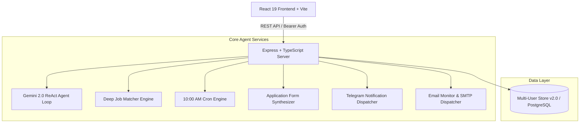

<div align="center">

# ⚡ Kinetic
### Autonomous AI Career Operating System & Multi-User Application Agent

[](https://www.typescriptlang.org/)
[](https://react.dev/)
[](https://tailwindcss.com/)
[](https://ai.google.dev/)
[](https://www.docker.com/)
[](LICENSE)

*An intelligent, multi-tenant autonomous career agent that scans live ATS feeds, performs deep match scoring, synthesizes tailor-made cover letters, prepares human-in-the-loop applications, and dispatches real-time telemetry to Telegram and Email.*

---

</div>

## 📌 Table of Contents
- [Overview](#-overview)
- [Key Features](#-key-features)
- [Multi-User SaaS & Credential Isolation](#-multi-user-saas--100-credential-isolation)
- [System Architecture](#-system-architecture)
- [Tech Stack](#-tech-stack)
- [Getting Started (Local Development)](#-getting-started-local-development)
- [Docker Setup](#-docker-setup)
- [Deploying to Render](#-deploying-to-render)
- [Environment Variables](#-environment-variables)
- [Project Directory Structure](#-project-directory-structure)
- [Author & Credits](#-author--credits)

---

## 🚀 Overview

**Kinetic** is an autonomous AI agent engineered to automate the job search and application pipeline. Powered by Google Gemini 2.0 and Node.js, Kinetic operates as an always-on career assistant that:

1. **Scrapes & Ingests Real Jobs**: Live integration across Greenhouse, Lever, RemoteOK, and custom job links.
2. **Deep Fit Scoring ($\ge 80\%$)**: Analyzes job requirements against candidate technical skills, years of experience, and architectural background.
3. **Automated 10:00 AM Routine**: Autonomously prepares and submits applications to at least **5 top-match roles daily**.
4. **Tailored Application Generation**: Generates customized cover letters, parses screening questions, and fills out application form fields.
5. **Multi-Channel Telemetry**: Sends instant Telegram notifications and rich HTML email digests directly to your inbox.
6. **Multi-User SaaS Workspaces**: 100% credential and profile isolation so any visitor can plug in their own resume and private Telegram bot.

---

## ✨ Key Features

| Feature | Description |
| :--- | :--- |
| 🤖 **Autonomous ReAct Agent Loop** | Multi-turn ReAct (Reason + Act) loop using Gemini 2.0 to search, evaluate, draft, and submit applications. |
| ⏰ **10:00 AM Daily Routine** | Scheduled autonomous cron job that triggers every morning, applies to target roles, and dispatches reports. |
| 🛡️ **100% Multi-User Isolation** | Isolated profiles, private Telegram tokens, chat IDs, cover letters, and application queues per user. |
| 📱 **Telegram Bot Integration** | Real-time push alerts for high-scoring jobs ($\ge 80\%$), submission confirmations, and recruiter interview invitations. |
| ✉️ **Email Pipeline & Monitor** | Inbound recruiter email classification (Screening, Interview, Offer, Rejection) with Gmail SMTP dispatch. |
| 📝 **Smart Cover Letter Engine** | Generates tailored cover letters with selectable tones (Professional, Startup/Enthusiastic, Concise). |
| 👤 **Resume Parser & Profile Manager** | Paste raw resume text to extract skills, experience highlights, preferred roles, and salary expectations. |
| 🎨 **Aalto Display & Dual Theme** | Elegant UI built with Aalto Display typography, Dark Obsidian theme, and Clean Light mode. |

---

## 🔒 Multi-User SaaS & 100% Credential Isolation

Kinetic features a multi-tenant backend architecture ensuring complete isolation between users:

* **Primary Showcase (`usr_pankaj_default`)**: Seeded with **Pankaj Kumar**'s 5+ years backend engineer profile and dedicated Telegram chat ID (`1276866292`).
* **Visitor & Demo Accounts**: Any visitor can create a new private account or use the **Alex Reed** Evaluator Demo.
* **Zero Credential Bleed**: When a visitor connects their own Telegram Bot Token or Chat ID, it stays strictly in their private workspace. Pankaj's personal credentials and alerts remain 100% protected and untouched.

```
┌─────────────────────────────────────────────────────────────┐
│                     Kinetic Multi-Tenant Engine              │
└──────────────────────────────┬──────────────────────────────┘
                               │
            ┌──────────────────┴──────────────────┐
            ▼                                     ▼
 ┌──────────────────────┐              ┌──────────────────────┐
 │  Pankaj Kumar (Root) │              │   Visitor Workspace  │
 │  • Chat ID: 1276866292              │  • Private Bot Token │
 │  • 5+ Yrs Backend Exp│              │  • Custom Chat ID    │
 │  • Dedicated Queue   │              │  • Private Resume    │
 └──────────────────────┘              └──────────────────────┘
```

---

## 🏗️ System Architecture



---

## 🛠️ Tech Stack

- **Frontend**: [React 19](https://react.dev/), [TypeScript](https://www.typescriptlang.org/), [Tailwind CSS v4](https://tailwindcss.com/), [Vite](https://vitejs.dev/), [Motion](https://motion.dev/), [Lucide Icons](https://lucide.dev/)
- **Backend**: [Node.js](https://nodejs.org/), [Express.js](https://expressjs.com/), [esbuild](https://esbuild.github.io/), [tsx](https://github.com/privatenumber/tsx)
- **AI & LLM**: Google Gemini 2.0 Flash (`@google/genai`)
- **Integrations**: Telegram Bot API, Nodemailer (Gmail SMTP)
- **Storage**: Multi-User File Store / PostgreSQL (`pg`)
- **Containerization**: Docker Multi-Stage Alpine Build

---

## 💻 Getting Started (Local Development)

### Prerequisites
- **Node.js**: v20.x or later
- **npm**: v10.x or later
- **Gemini API Key**: Get a key from [Google AI Studio](https://aistudio.google.com/)

### 1. Clone the repository
```bash
git clone https://github.com/pankajkumar-dev/AI-Job-Search-&-Application-Agent.git
cd AI-Job-Search-&-Application-Agent
```

### 2. Install dependencies
```bash
npm install
```

### 3. Configure environment variables
Create a `.env` file in the root directory:
```env
# Google Gemini API
GEMINI_API_KEY="your_gemini_api_key_here"

# Server Port
PORT=3005

# App URL
APP_URL="http://localhost:3005"

# Telegram Bot (Optional for local testing)
TELEGRAM_BOT_TOKEN="your_bot_token_here"
TELEGRAM_CHAT_ID="your_chat_id_here"
```

### 4. Run development server
```bash
npm run dev
```
Open [http://localhost:3005](http://localhost:3005) in your browser.

---

## 🐳 Docker Setup

### 1. Build Docker image
```bash
docker build -t kinetic-agent .
```

### 2. Run Docker container
```bash
docker run -d \
  -p 3005:3005 \
  -e GEMINI_API_KEY="your_gemini_api_key_here" \
  -e PORT=3005 \
  --name kinetic-app \
  kinetic-agent
```
Access the application at [http://localhost:3005](http://localhost:3005).

---

## ☁️ Deploying to Render

Kinetic is pre-configured for one-click deployment on [Render](https://render.com/):

1. **Push to GitHub**:
   ```bash
   git add .
   git commit -m "feat: ready for deploy"
   git push origin main
   ```
2. **Create New Web Service on Render**:
   - Connect your GitHub repository.
   - **Environment**: `Node` (or `Docker`).
   - **Build Command**: `npm install && npm run build`
   - **Start Command**: `npm start` (runs `node dist/server.cjs`)
   - **Environment Variables**:
     - `GEMINI_API_KEY` = `your_gemini_api_key`
     - `NODE_ENV` = `production`
     - `PORT` = `10000` (Render defaults to 10000)

---

## 🔑 Environment Variables

| Variable | Description | Required | Default |
| :--- | :--- | :---: | :--- |
| `GEMINI_API_KEY` | Google Gemini 2.0 API Key for LLM reasoning | **Yes** | — |
| `PORT` | Server listening port | No | `3005` |
| `APP_URL` | Public URL of the deployed application | No | `http://localhost:3005` |
| `DATABASE_URL` | PostgreSQL connection string (if using PG) | No | — |
| `TELEGRAM_BOT_TOKEN` | Global fallback bot token | No | — |
| `TELEGRAM_CHAT_ID` | Global fallback chat ID | No | — |

---

## 📁 Project Directory Structure

```
├── data/                       # Local persistent multi-tenant data store
├── dist/                       # Compiled production frontend & server bundle
├── scripts/                    # Database migration & automation scripts
├── server/
│   ├── db.ts                   # Multi-User Database Store v2.0 & user scoping
│   ├── routes/
│   │   └── api.ts              # Authenticated REST API endpoints
│   └── services/
│       ├── agentLoop.ts        # Gemini 2.0 autonomous ReAct loop
│       ├── applicationService.ts# Cover letter & form synthesis
│       ├── emailService.ts     # Inbound email classifier & Gmail SMTP
│       ├── jobService.ts       # ATS scraping & match scoring engine
│       ├── schedulerService.ts # 10:00 AM daily routine cron manager
│       └── telegramService.ts  # Telegram Bot notification dispatches
├── src/
│   ├── components/
│   │   ├── AgentConsoleView.tsx       # Live autonomous agent terminal
│   │   ├── ApplicationApprovalModal.tsx# Human-in-the-loop approval modal
│   │   ├── ApplicationsView.tsx       # Application pipeline manager
│   │   ├── AuthModal.tsx              # Multi-user account center & switcher
│   │   ├── CoverLettersView.tsx       # Tailored cover letter library
│   │   ├── DashboardView.tsx          # Analytics & telemetry dashboard
│   │   ├── DeveloperLandingPage.tsx   # Interactive developer showcase
│   │   ├── EmailMonitorView.tsx       # Recruiter email monitor & classifier
│   │   ├── JobsView.tsx               # Live ATS job discovery feed
│   │   ├── Navbar.tsx                 # Top navigation, ticker & user switcher
│   │   ├── ProfileView.tsx            # Candidate profile & resume editor
│   │   ├── SettingsView.tsx           # Routine, Telegram & Theme settings
│   │   └── TelegramConnectModal.tsx   # 1-Click Telegram Bot connect modal
│   ├── types.ts                # TypeScript data interfaces & types
│   ├── App.tsx                 # Root application component & auth provider
│   └── main.tsx                # React 19 entry point
├── Dockerfile                  # Multi-stage production container configuration
├── package.json                # Project dependencies & build scripts
├── server.ts                   # Express server entry point
├── tsconfig.json               # TypeScript compiler options
└── vite.config.ts              # Vite frontend configuration
```

---

## 👨‍💻 Author & Credits

* **Developer**: Pankaj Kumar ([@pankajkumar-dev](https://github.com/pankajkumar-dev))
* **Email**: [codepankaj84@gmail.com](mailto:codepankaj84@gmail.com)
* **LinkedIn**: [linkedin.com/in/pankajkumar-dev](https://linkedin.com/in/pankajkumar-dev)

---

## 📄 License

This project is licensed under the [MIT License](LICENSE).